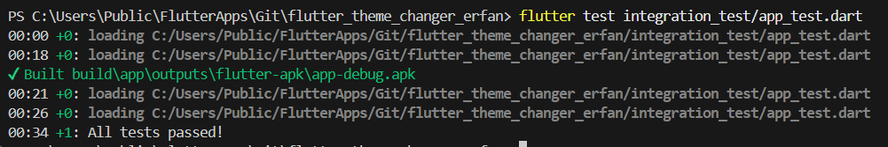

# Flutter Dynamic Theme Changer

A Flutter package that allows you to easily change your app's theme color dynamically at runtime using Riverpod.  
It provides both a **full theme changer wrapper** and a **beautiful color picker widget**!

## ✨  Features

- 🎨 Dynamic primary color theme switching.
- 🧩 Ready-to-use ThemeColorPickerWidget and ThemeChanger.
- 🌈 Allow users to pick from customizable color palettes.
- 🚀 Built with Flutter Riverpod 2.0 (StateNotifier based).
- 🎯 Simple API and easy integration.
- ✍️ Fully customizable if needed.

## Getting started

Add this to your package's `pubspec.yaml` file:

```yaml
dependencies:
  flutter_theme_changer_erfan: ^0.0.1+1
```
Then run `flutter pub get` to install the package.

## 🛠️ How to Use

Wrap your app using ThemeChanger:

```dart
import 'package:flutter_riverpod/flutter_riverpod.dart';
import 'package:dynamic_theme_picker/dynamic_theme_picker.dart';

void main() {
  runApp(const ProviderScope(child: MyApp()));
}

class MyApp extends StatelessWidget {
  const MyApp({super.key});

  @override
  Widget build(BuildContext context) {
    return const ThemeChanger(
      title: 'Dynamic Theme Demo',
      child: HomeScreen(),
    );
  }
}

```
Then i nside your app, use ThemeColorPickerWidget anywhere you want:


```dart
class HomeScreen extends StatelessWidget {
  const HomeScreen({super.key});

  @override
  Widget build(BuildContext context) {
    return Scaffold(
      appBar: AppBar(title: const Text('Home')),
      body: const Center(
        child: ThemeColorPickerWidget(), // <-- Tap to pick a new theme color!
      ),
    );
  }
}

```

## 🎨 Customizing the Color Picker

You can pass a custom list of colors to the ThemeColorPickerWidget:

```dart

ThemeColorPickerWidget(
  availableColors: [
    Colors.teal,
    Colors.indigo,
    Colors.deepOrange,
    Colors.cyan,
    Colors.lime,
    Colors.amber,
  ],
)

```

You can also use ThemeColorPicker (the stateless version) for manual color selection:

```dart

ThemeColorPicker(
  availableColors: [Colors.blue, Colors.red, Colors.green],
  onColorSelected: (color) {
    // Do something when a color is picked
  },
)

```

## 📦 What's Inside

Widget/File | Purpose
ThemeChanger | Wraps your app with dynamic theming.
ThemeColorPickerWidget | A widget that expands to show selectable colors.
ThemeColorPicker | Stateless color picker (manual control).
ThemeNotifier + themeProvider | Riverpod logic for managing and updating theme color.


## 📲 Example

A full working example is available inside the /example folder.

To run the example locally:

```bash

flutter run --target=example/lib/main.dart

```
You'll see a floating color button — tap it, pick a color, and the app's theme changes instantly!

## ✅ All tests passed,including integration tests 



## 🙌 Contributing
Contributions are welcome!
Feel free to open issues or submit pull requests if you'd like to help!

## 🔥 Author
Erfan Alizada. Developed with ❤️ using Flutter and Riverpod.

## Additional information

- For more examples, check out the example directory
- Report bugs on the [issue tracker](https://github.com/erfanalizada/flutter_theme_changer_erfan/issues)
- Contribute to the package on [GitHub](https://github.com/erfanalizada/flutter_theme_changer_erfan)


## 📄 License MIT
This project is licensed under the MIT License.
See the LICENSE file for more details.
